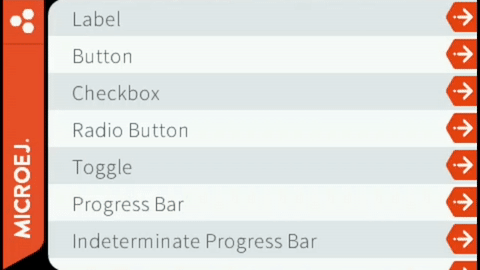

# Overview

This repository contains an application with some widget implementations as well as usage examples for these widgets and
for the widgets of the Widget library.

At startup, it shows a list of items.
Clicking on an item opens a new page showing a widget or a set of widgets.
In each of these pages, a button allows to go back to the main list.

For each page, a package exists in the source with the same name.
(Example for the `Label` page: `com.microej.demo.widget.label`.)
The package contains the page and some widgets if necessary.

Each page class contains 2 methods:

- `getContentWidget()` that creates the page content (the hierarchy of widgets and containers),
- `populateStylesheet(CascadingStylesheet)` that creates the styles for the widgets in the page.

Here are the pages:

- `Label`: demonstrates the simple `Label` widget from the widget library.
- `AutoscrollLabel`: demonstrates a label which autoscroll when the label text is longer than label length.
- `Image Widget` : demonstrates how to display an image using `ImageWidget` from the widget library.
- `Animated image`: demonstrates an `AnimatedImage` widget.
- `Slider with value` : demonstrates a slider with displayed value.
- `Slider with progress` : demonstrates a slider with progress.
- `Circular Slider` : demonstrates a circular slider.
- `Double Temperature Slider` : demonstrates a double slider with a dynamic gradient.
- `Button`: demonstrates different styles of the simple `Button` widget from the widget library.
- `Checkbox`: demonstrates a `Checkbox` widget.
- `Radio Button`: demonstrates a `RadioButton` widget.
- `Toggle`: demonstrates a `Toggle` widget animated when its state changes.
- `Progress Bar`: demonstrates a `ProgressBar` widget.
- `Indeterminate Progress Bar`: demonstrates an `IndeterminateProgressBar` widget.
- `Keyboard`: demonstrates a keyboard widget.
- `Circular Indeterminate Progress`: demonstrates a `CircularIndeterminateProgress` widget.
- `Circular Dotted Progress`: demonstrates a `CircularDottedProgress` widget.
- `Circular Progress`: demonstrates a `CircularProgress` widget.
- `Circular Progress With Gradient`: demonstrates a `CircularProgressWithGradient` widget.
- `Wheel` : demonstrates a `Wheel` widget.
- `WheelWithHighlight` : demonstrates a `WheelWithHighlight` widget, where the selected item is highlighted with a larger font.
- `ScrollingTextOnCircle` : demonstrates a `ScrollingTextOnCircle` widget, which draws a scrolling text on a circle.
- `Carousel`: demonstrates a `Carousel` widget.
- `List`: demonstrates the `List` container from the widget library.
- `Grid`: demonstrates the `Grid` container from the widget library.
- `Fixed Grid`: demonstrates the `FixedGrid` container from the widget library.
- `Flex`: demonstrates the `Flex` container from the widget library.
- `Dock`: demonstrates the `Dock` container from the widget library.
- `Split`: demonstrates a `Split` container.
- `Scrollable List`: demonstrates a `ScrollableList` container.
- `Scrollable Text`: demonstrates displaying a long, scrollable text.
- `Snap Scroll`: demonstrates a scroll that snaps on its children.
- `Secret Scroll`: demonstrates a container with an hidden child that can be shown by scrolling.
- `Buffered Scroll`: demonstrates a scroll that uses the display buffer to scroll faster.
- `Alphabet Scroll`: demonstrates a scroll that can be navigated using an index.
- `Selectable List`: demonstrates a list of items that are selectable with an animation.
- `Line Chart`: demonstrates a `LineChart` widget.
- `Bar Chart`: demonstrates a `BarChart` widget.

# Requirements

- MICROEJ SDK 6.
- A VEE Port that contains:

    - EDC-1.3 or higher.
    - BON-1.4 or higher.
    - MICROUI-3.4 or higher.
    - DRAWING-1.0 or higher.

This example has been tested on:

- IntelliJ IDEA 2023.3.3.
- STM32F7508-DK VEE Port 2.2.0.

# Usage

By default, the sample will use the STM32F7508-DK VEE Port.

Refer to the [Select a VEE Port](https://docs.microej.com/en/latest/SDK6UserGuide/selectVeePort.html) documentation for more information.

## Configuration

Configuration options can be found in: `configuration/common.properties`.

The example is configured to run on a Mono-Sandbox VEE Port:

- The Java heap (`core.memory.javaheap.size`) should be increased on a Multi-Sandbox VEE Port.
- In the same way, the number of threads (`core.memory.thread.max.size`, `core.memory.threads.pool.size`, `core.memory.threads.size`) should be increased.

The example is optimized for a WQVA (480x272) display with 16 bpp pixel format:

- The required [image heap](https://docs.microej.com/en/latest/ApplicationDeveloperGuide/UI/MicroUI/images.html#images-heap) should be adjusted according to the VEE Port used to run the sample.
- The scrollable pages may not scroll if their content is not large enough for the display size.

## Run on simulator

In IntelliJ IDEA or Android Studio:

- Open the Gradle tool window by clicking on the elephant icon on the right side,
- Expand the `Tasks` list,
- From the `Tasks` list, expand the `microej` list,
- Double-click on `runOnSimulator`,
- The application starts, the traces are visible in the Run view.

Alternative ways to run in simulation are described in the [Run on Simulator](https://docs.microej.com/en/latest/SDK6UserGuide/runOnSimulator.html) documentation.

## Run on device

Make sure to properly setup the VEE Port environment before going further.
Refer to the VEE Port README for more information.

In IntelliJ IDEA or Android Studio:

- Open the Gradle tool window by clicking on the elephant on the right side,
- Expand the `Tasks` list,
- From the `Tasks` list, expand the `microej` list,
- Double-Click on `runOnDevice`.
- The device is flashed. Use the appropriate tool to retrieve the execution traces.

Alternative ways to run on device are described in the [Run on Device](https://docs.microej.com/en/latest/SDK6UserGuide/runOnDevice.html) documentation.

# Dependencies

_All dependencies are retrieved transitively by gradle_.

# Source

N/A

# Restrictions

None.

---  
_Copyright 2020-2024 MicroEJ Corp. All rights reserved._  
_Use of this source code is governed by a BSD-style license that can be found with this software._  
